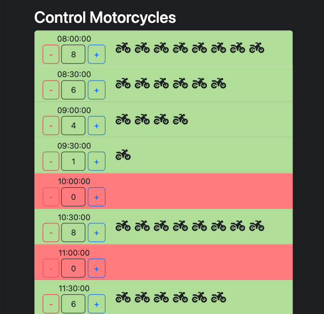

# Laravel 10 with svelte and innertia

This project test a mix technologies, for build motorcycles management. 

## Stack

- docker (sail)
- mysql
- laravel 10
- innertia
- svelte
- vite
- bootstrap

## Run docker

### On Macos or linux

1. Add permisions to script `chmod +x build_project.sh`
2. Build current proyect of laravel `./build_project.sh`
3. Open [http://localhost](http://localhost)

| [https://laravel.com/docs/9.x/sail#installing-composer-dependencies-for-existing-projects](https://laravel.com/docs/9.x/sail#installing-composer-dependencies-for-existing-projects)

### On windows (with wsl)

1. Configure SWL2 [https://dev.to/robencom/laravel-sail-on-windows-1pgk](https://dev.to/robencom/laravel-sail-on-windows-1pgk)
2. On step 10, use script `build_project.sh`
3. Open [http://localhost](http://localhost)

### Parameters

> .env

Limit motorcycles, `MAX_MOTORCYCLES`.

### Issues

- If not show nothing, migrate with seeder
- Check docker image
- Check ports
